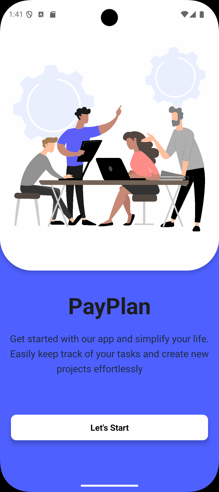
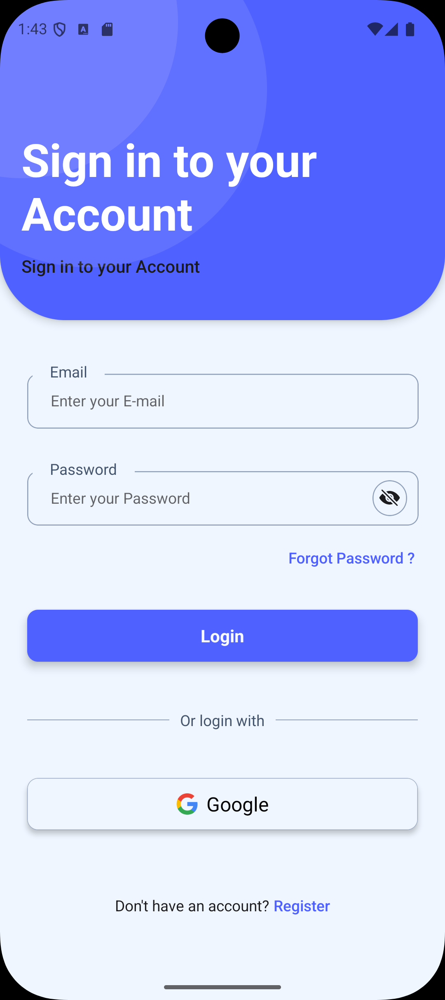
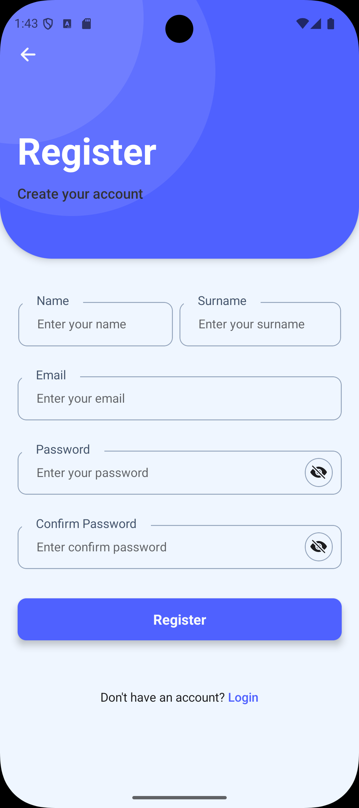

# 🤝 PayPlan — Sosyal Görev ve Etkinlik Takip Uygulaması

PayPlan, arkadaşlarınla veya ekibinle birlikte etkinlik planlayabildiğin, görevleri bölüştüğün, oylama yapabildiğin ve anlık bildirimlerle haberdar olduğun bir mobil uygulamadır.
Tatil planı, alışveriş listesi, ders çalışma grubu ya da bir startup görev panosu gibi birçok senaryoya uyarlanabilir.

---

## 🌟 Özellikler

- ✅ Grup oluşturma (arkadaş, aile, ekip, vb.)
- ✅ Görev, etkinlik, alışveriş listesi ekleme
- ✅ Görevleri oylamaya açma: “Bunu kim yapacak?”
- ✅ Gerçek zamanlı bildirim alma
- ✅ Grup içi chat alanı
- ✅ Takvim entegrasyonu & hatırlatıcılar
- ✅ Görev atama ve due date belirleme

---

## 📱 Kullanım Senaryoları

### 🏖️ Tatil Planı

- “Kim araba kiralayacak?”
- “Kim oteli ayarlayacak?”

### 🎓 Ders Çalışma Grubu

- “Kim hangi konuyu çalıştı?”
- “Quiz ne zaman?”

### 🛒 Ortak Alışveriş Listesi

- “Kim markete gidecek?”
- “Kim kahve alacak?”

### 🚀 Startup Takım Panosu

- Görev atamaları
- Takip panosu
- Notifikasyonlar

---

## 🛠️ Kullanılan Teknolojiler

### Frontend (Mobil)

- **React Native**
- **Redux Toolkit** (Durum yönetimi)
- **React Navigation** (Sayfa geçişleri)
- **Expo** (Uygulama geliştirme kolaylığı)
- **Styled Components / CSS**

### Backend

- **Node.js + Express.js**
- **MongoDB** (NoSQL veritabanı)
- **CORS** (Güvenli API bağlantısı)

### Diğer Entegrasyonlar

- **Firebase Cloud Messaging (FCM)** → Anlık bildirimler
- **Socket.IO / Firebase Realtime DB** → Gerçek zamanlı veri yönetimi
- **react-native-calendars** → Takvim görüntüleme
- **react-native-push-notification** → Hatırlatıcı bildirimler
- **expo-auth-session** → Google / Apple Login
- **@react-native-async-storage/async-storage** → Offline destek

---

## 👥 Hedef Kitle

- Gençler → Tatil planı, etkinlik koordinasyonu
- Öğrenciler → Ders programı, çalışma grubu
- Startup ekipleri → Task management & iş birliği
- Aileler → Alışveriş & yapılacaklar listesi

---

## 🚧 Geliştirme Durumu

> Uygulama halen aktif geliştirme aşamasındadır.
> Aşağıdaki bölümler tamamlanmıştır:

- ✅ Login / Register ekranları
- ✅ Grup oluşturma ve grup listesi
- ✅ Grup detay ekranı
- ✅ Görev oluşturma arayüzü

Yapılacaklar:

- 🔄 Oylama sistemi
- 🔄 Bildirim sistemi
- 🔄 Chat entegrasyonu
- 🔄 Takvim entegrasyonu

---

## 📌 Kurulum Talimatları

```bash


# Frontend için:
cd client
npm install
npx expo start
```

---

## 📸 Ekran Görüntüleri

> Geliştirme tamamlandıkça buraya ekran görüntüleri eklenecek.

 <!-- 
 

 -->
<p align="center">
  
  
  
</p>

## 📬 Katkıda Bulunmak İster misin?

Pull request'lere ve geri bildirimlere açığız.
İletişim: \[[musasayar67@gmail.com](mailto:musasayar67@gmail.com)]

>

---

## 🧑‍💻 Geliştirici Notu

> Bu uygulama, genç ekipler ve dinamik gruplar için hızlı görev paylaşımı, eğlenceli iş bölümü ve sosyal etkileşimi kolaylaştırmayı amaçlar.
